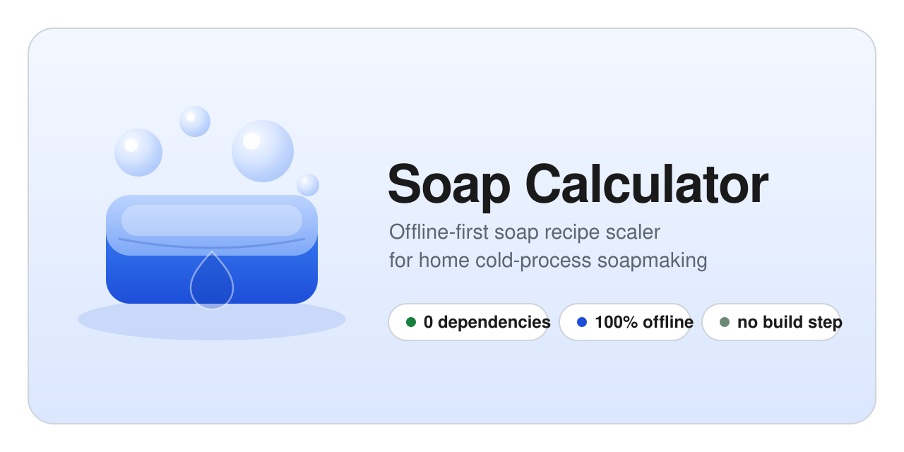

  

  
  
  
  
  

  A self-hosted, offline-first soap recipe scaler for cold-process soapmaking at home.

## What it is

A small browser-based calculator that replaces the spreadsheet workflow for
scaling a soap recipe from one anchor ingredient. It runs as a tiny Node.js
service on a home Ubuntu Server (or any homelab box) and is reachable from any
phone, tablet, or laptop on the same network. After install it never touches
the internet again — handy for a permanent kitchen-counter appliance.

## Key features

- Anchor-based input: enter the weight of any ingredient (or the total) and
  the rest of the recipe is calculated from it
- Heavy / Light essential oil toggle
- Grams or ounces, switchable on the fly (storage is always in grams)
- Save and load named recipes, with optional notes
- Soap log: track every batch you make, see at a glance what's curing vs.
  ready to use, and search past batches by name, ingredient, or notes
- Measuring mode — locks the inputs and shows tappable checkboxes for working
  through a recipe at the counter
- Printable recipe sheets with a Measured-checkbox column for ticking off
  ingredients in pen as you weigh them
- 100% offline after install — no internet connection ever required
- Accessible from any device on your home network, no app to install

## Quick start

See [docs/INSTALL.md](docs/INSTALL.md) for the full install guide. Once it's
running you'll visit `http://<your-server-ip>:8030` from any device on the
network to use it.

## Documentation

- [Install guide](docs/INSTALL.md) — step-by-step setup on a fresh Ubuntu Server
- [User guide](docs/USER_GUIDE.md) — features and day-to-day workflows
- [Troubleshooting](docs/TROUBLESHOOTING.md) — common problems and fixes
- [Changelog](CHANGELOG.md) — release history

## Specification

For the full technical detail — calculation model, data shape, HTTP surface,
deployment layout — see [SPEC.md](SPEC.md).

## License

MIT — see [LICENSE](LICENSE).
