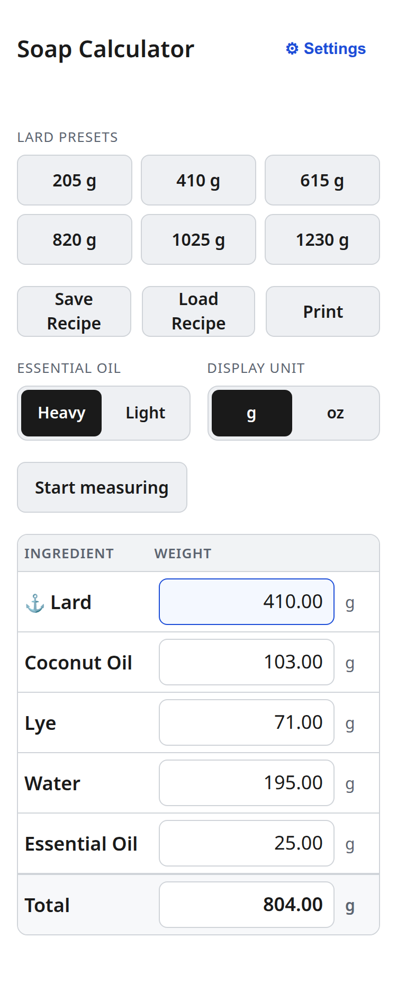

# Install guide

This walks you through installing the soap calculator on a fresh Ubuntu
Server from scratch. Top to bottom, the whole thing usually takes 10–15
minutes.

If a command starts with `sudo`, copy the whole line including `sudo` —
that's the part that runs the command with administrator permissions, which
some of the steps need.

## Before you start

- A working Ubuntu Server LTS install. If you haven't done that part yet,
  follow [Ubuntu's official server install guide](https://ubuntu.com/tutorials/install-ubuntu-server)
  first.
- You can SSH into the server as a user that can run `sudo` commands.
- The server is connected to your home network **and** can reach the
  internet for this install. It will not need internet again after you're
  done.
- A second device — laptop, phone, or tablet — on the same network. You'll
  use it at the end to confirm that other devices can reach the calculator.

That's the whole list. You don't need to know systemd, or what a port is,
or how Linux services work. Each step below explains what it's doing.

---

## Step 1: Find your server's IP address

Every device on your home network has an IP address — a number like
`192.168.1.42`. The calculator will be reachable through your server's IP,
so you need to know what it is.

On the server, run:

```
ip addr show
```

You'll see a few blocks of text, one per network interface. Look for a
block whose name starts with `eth` (wired) or `wlan`/`wlp` (Wi-Fi) — not
`lo`, which is the loopback interface and doesn't count. Inside that
block, find the line that begins with `inet`. The number right after `inet`
is your server's LAN IP. For example:

```
2: enp0s3: <BROADCAST,MULTICAST,UP,LOWER_UP> ...
    inet 192.168.1.42/24 brd 192.168.1.255 scope global enp0s3
```

The number right after `inet` — in the example above, `192.168.1.42` — is
your server's IP. The `/24` part is the subnet mask, which you can ignore.

**Write this IP down.** You'll use it at the end and probably want it on a
sticky note for the future.

(Alternative: most home routers have an admin page that lists connected
devices and their IPs. Look for one labeled with your server's hostname.
Every router's admin page is different so we won't cover specifics here.)

---

## Step 2: Install Node.js

Node.js is the runtime that the calculator's tiny web server is written in.
Install it from Ubuntu's standard software repository:

```
sudo apt update
sudo apt install -y nodejs
```

`apt update` refreshes the list of available packages, then `apt install`
installs `nodejs`. The `-y` flag means "yes, install it" so you don't have
to confirm.

> **✓ Verify**
>
> Run: `node --version`
>
> Expected output: a version number starting with `v20`, `v22`, or higher
> (for example `v20.18.1`).
>
> If you see something different, see TROUBLESHOOTING.md (coming soon).

If the version is older than `v20` (some older Ubuntu LTS releases ship an
older Node in apt), install a newer Node from NodeSource by following
[their official instructions](https://github.com/nodesource/distributions).
This is the only install step that might require extra internet beyond
`apt`, and it's a one-time thing.

---

## Step 3: Get the code onto the server

We'll use `git` to download the calculator's source code. If `git` isn't
already installed, install it:

```
sudo apt install -y git
```

Then change into `/opt`, which is the standard place on a Linux system for
"installed applications that didn't come from the package manager":

```
cd /opt
```

And clone the calculator's repository:

```
sudo git clone https://github.com/<your-github-username>/soap-calc.git soapcalc
```

Replace `<your-github-username>` with the actual GitHub username hosting
the repository (or your own, if you've forked it). The final `soapcalc` on
the line is the directory name we want it cloned into — `/opt/soapcalc/`.

---

## Step 4: Create the soapcalc system user

For safety, the calculator should run as its own dedicated user account,
not as `root` and not as your normal login. That way if something ever
goes wrong with the calculator, it can't accidentally affect anything else
on the system.

Create the user:

```
sudo useradd --system --no-create-home --shell /usr/sbin/nologin soapcalc
```

The flags say: it's a system user (`--system`), it doesn't need a home
directory (`--no-create-home`), and nobody can log in as this user
(`--shell /usr/sbin/nologin`). It's a "user" only in the sense that the
calculator process will run under its name.

---

## Step 5: Create the data directory

The calculator stores its saved recipes and factor settings in a single
JSON file. That file lives in `/var/lib/soapcalc/`, which is the standard
Linux location for a service's persistent data.

Create the directory and hand ownership to the `soapcalc` user:

```
sudo mkdir -p /var/lib/soapcalc
sudo chown soapcalc:soapcalc /var/lib/soapcalc
sudo chmod 750 /var/lib/soapcalc
```

`chown` sets the owner of the directory; `chmod 750` sets its permissions
so that only the `soapcalc` user and members of the `soapcalc` group can
read or write inside it. You don't need to create the data file yourself —
the calculator will do that automatically the first time it starts.

---

## Step 6: Install the configuration file

The calculator reads a small configuration file at `/etc/soapcalc.conf`
that controls things like which port it listens on. Copy the example file
into place:

```
sudo cp /opt/soapcalc/deploy/soapcalc.conf.example /etc/soapcalc.conf
```

The default port is **8030**. For almost everyone, that's fine, and you
can move on to Step 7.

**Only if you need to change the port** — for example, because something
else on the server already uses 8030 — open the config file:

```
sudo nano /etc/soapcalc.conf
```

Find the line that says `PORT=8030` and change the number. Press
`Ctrl+O` then `Enter` to save, then `Ctrl+X` to exit. If you do change
the port, remember the new number — you'll use it in Steps 9 and 10.

---

## Step 7: Install the systemd service

`systemd` is the part of Ubuntu that manages background services — things
like SSH, the network manager, and now the soap calculator. We need to
register the calculator with systemd so it starts automatically on boot
and restarts itself if it ever crashes.

Copy the service definition into place and tell systemd to re-read its
configuration:

```
sudo cp /opt/soapcalc/deploy/soapcalc.service /etc/systemd/system/
sudo systemctl daemon-reload
```

`daemon-reload` doesn't start anything — it just tells systemd to notice
the new file. Starting happens in the next step.

---

## Step 8: Enable and start the service

This is the important step — it's what makes the calculator actually run.

> The next command does two things: it tells systemd to start the service
> **right now**, and it tells systemd to start the service **automatically
> every time the server boots from now on**. This is what makes the
> calculator survive reboots without you needing to do anything.

```
sudo systemctl enable --now soapcalc
```

> **✓ Verify**
>
> Run: `sudo systemctl status soapcalc`
>
> Expected output: somewhere in the first few lines you should see
> `Active: active (running)`. Press `q` to exit the status view.
>
> If you see `failed` or `inactive` instead, see TROUBLESHOOTING.md
> (coming soon).

> **✓ Verify**
>
> Run: `curl http://localhost:8030/health`
>
> Expected output: `{"status":"ok"}`
>
> If you see something different, see TROUBLESHOOTING.md (coming soon).
> (If you changed the port in Step 6, use your new port number instead
> of 8030.)

---

## Step 9: Open the firewall (if you have one)

Ubuntu may include a firewall called `ufw` that, when active, blocks
incoming connections from other devices on your network. We need to
check whether it's running, and if it is, tell it to allow connections
on the calculator's port.

Check the firewall's status:

```
sudo ufw status
```

If the output says `Status: inactive`, there's no firewall blocking
anything. **Skip the rest of this step** and move on to Step 10.

If it says `Status: active`, open port 8030 (or your custom port from
Step 6):

```
sudo ufw allow 8030/tcp
```

This allows other devices on your network to reach port 8030 on the
server. Because the server is behind your home router, this **does not**
expose the port to the internet at large — only to devices on your home
LAN.

---

## Step 10: Verify access from another device

This is the moment of truth.

From your phone, tablet, or another computer on the same network, open a
browser to:

```
http://<your-server-ip>:8030
```

…using the IP you wrote down in Step 1, and the port from Step 6 if you
changed it. Example: `http://192.168.1.42:8030`.

> **✓ Verify**
>
> The calculator UI loads in the browser. You can click one of the lard
> preset buttons (for example, **410 g**) and the other ingredients fill
> in with computed weights. The page is touch-friendly on a phone.
>
> If the page doesn't load at all, see TROUBLESHOOTING.md (coming soon).

This is what it should look like on a phone:



---

## Step 11: Verify autostart by rebooting

The most important verification of all: does the calculator actually come
back up after a power cycle? A home-server appliance is only useful if it
does.

Reboot the server:

```
sudo reboot
```

Your SSH session will disconnect. Wait about 30 seconds, then re-open the
calculator URL from your other device.

> **✓ Verify**
>
> The calculator page loads from your other device — without you having
> to touch the server, log back in, or run any commands.
>
> If it doesn't load, see TROUBLESHOOTING.md (coming soon).

---

## You're done

The calculator is installed. It will start automatically every time the
server boots, restart itself if it ever crashes, and will never need
internet access again. If you want, you can disconnect the server's
internet connection now — wired or Wi-Fi — and everything will keep
working.

Bookmark `http://<your-server-ip>:8030` on your phone and you're set.

---

## Reference

A short reference for when you come back to this later.

### Where things live

| What | Where |
|---|---|
| Application code | `/opt/soapcalc/` |
| Data file (recipes, factors) | `/var/lib/soapcalc/data.json` |
| Configuration | `/etc/soapcalc.conf` |
| Service definition | `/etc/systemd/system/soapcalc.service` |
| Service logs | Run `sudo journalctl -u soapcalc` |

### Common commands

```
sudo systemctl status soapcalc      # Is the service running?
sudo systemctl restart soapcalc     # Restart it
sudo systemctl stop soapcalc        # Stop it
sudo journalctl -u soapcalc -n 50   # Show the last 50 lines of its logs
```

### Change the port

Edit the config file:

```
sudo nano /etc/soapcalc.conf
```

Change the `PORT=` line, save with `Ctrl+O` and `Enter`, exit with `Ctrl+X`,
then restart the service so it picks up the new port:

```
sudo systemctl restart soapcalc
```

If you have `ufw` active, also open the new port and (optionally) close
the old one:

```
sudo ufw allow <new-port>/tcp
sudo ufw delete allow 8030/tcp
```

### Back up your data

Everything the calculator knows — every recipe you've saved, every factor
you've customized — is in a single file: `/var/lib/soapcalc/data.json`.

To back it up, copy that file somewhere safe (a USB stick, another
machine, your laptop):

```
sudo cp /var/lib/soapcalc/data.json ~/soapcalc-backup.json
```

To restore from a backup later, stop the service, replace the file, fix
its ownership, and restart:

```
sudo systemctl stop soapcalc
sudo cp ~/soapcalc-backup.json /var/lib/soapcalc/data.json
sudo chown soapcalc:soapcalc /var/lib/soapcalc/data.json
sudo systemctl start soapcalc
```

### Updating to a new version

This is the only reason you'll need to reconnect the server to the
internet after install. Reconnect, then:

```
cd /opt/soapcalc
sudo git pull
sudo systemctl restart soapcalc
```

Disconnect the server's internet again afterwards if that's what you
prefer.

### Uninstalling

If you want to remove the calculator entirely:

```
sudo systemctl disable --now soapcalc
sudo rm /etc/systemd/system/soapcalc.service
sudo systemctl daemon-reload
sudo rm -rf /opt/soapcalc
sudo rm /etc/soapcalc.conf
sudo userdel soapcalc
```

**Warning:** the next command deletes all your saved recipes. Skip it if
you want to keep them:

```
sudo rm -rf /var/lib/soapcalc
```
