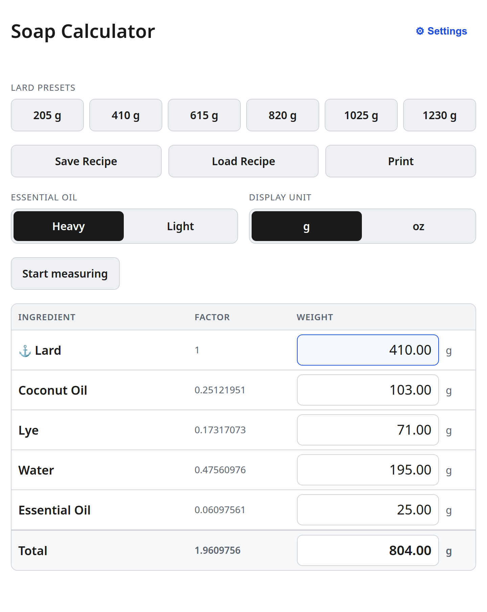
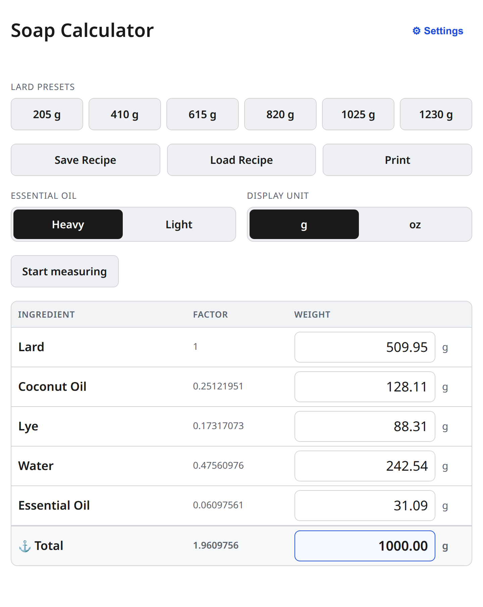
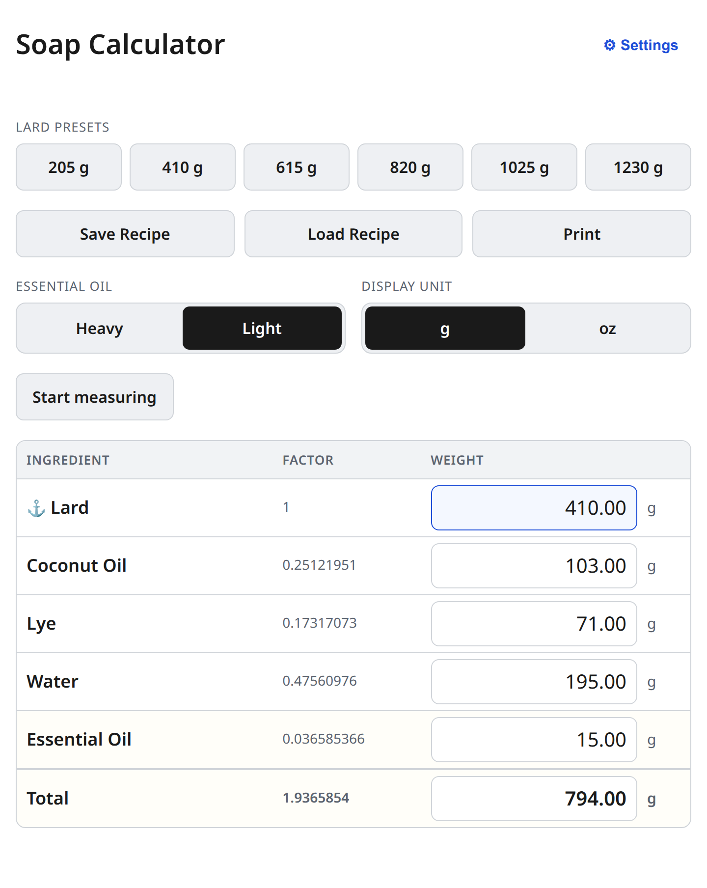
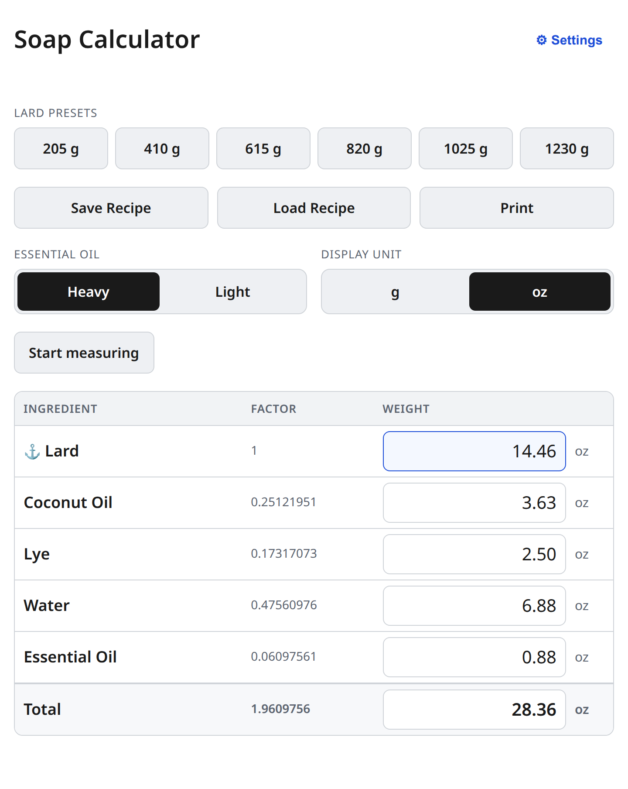
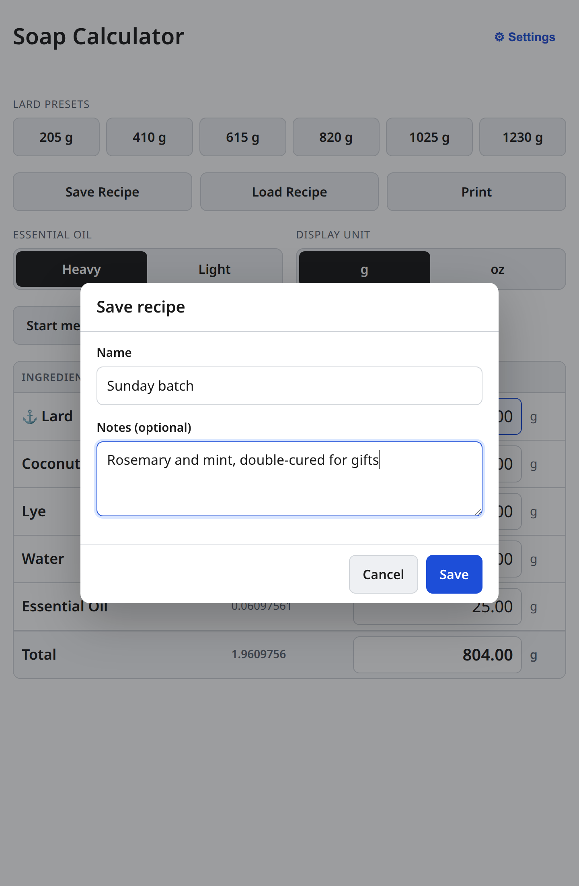
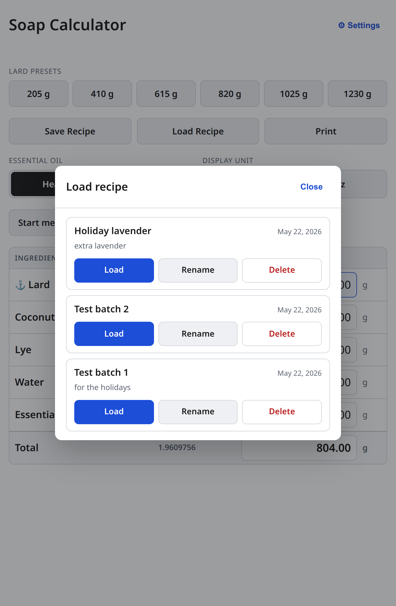
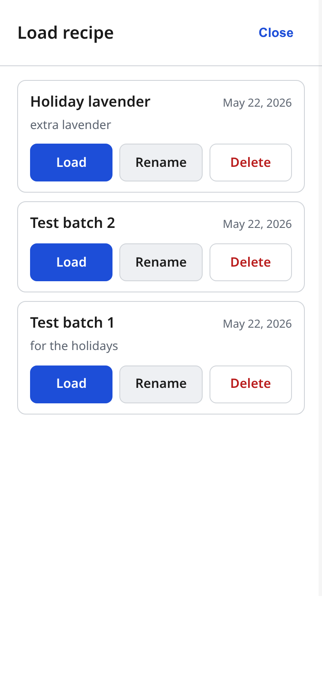
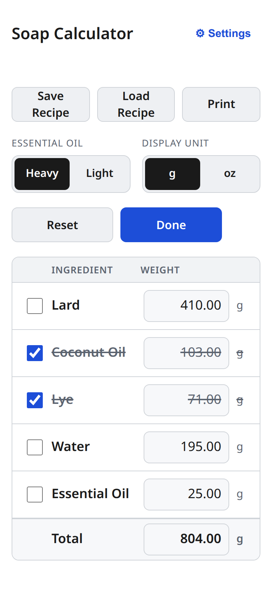
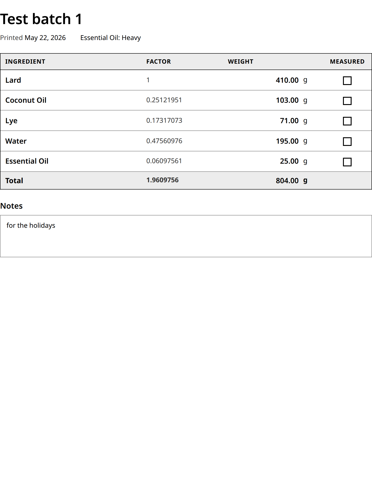
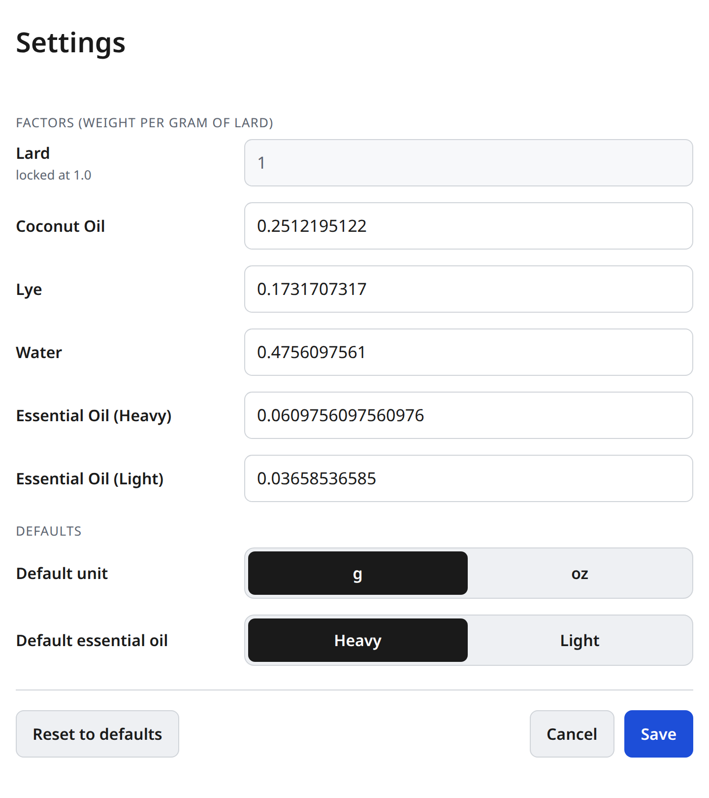

# User guide

How to use the soap calculator day-to-day. This guide is organized by
feature — skim the table of contents and jump to the part you need.

- [The basics](#the-basics)
- [Calculating a batch from lard](#calculating-a-batch-from-lard)
- [Calculating a batch from any other ingredient](#calculating-a-batch-from-any-other-ingredient)
- [Heavy vs. Light essential oil](#heavy-vs-light-essential-oil)
- [Grams or ounces](#grams-or-ounces)
- [Saving and loading recipes](#saving-and-loading-recipes)
- [Measuring mode](#measuring-mode)
- [Printing a recipe](#printing-a-recipe)
- [Adjusting the factors](#adjusting-the-factors)
- [Tips for kitchen use](#tips-for-kitchen-use)

---

## The basics

The calculator works from ratios. Soap recipes are usually written as
"for every X grams of lard, use Y grams of coconut oil, Z grams of lye,"
and so on. Those ratios are built into the app — the defaults come from
the original spreadsheet the app was built to replace.

To calculate a batch, you type the weight of any **one** ingredient. The
app fills in everything else based on the ratios.

The ingredient you type into is called the **anchor** — it's the one
number that drives the calculation. Every other ingredient is computed
from the anchor. You can always tell which field is the anchor because it
has a highlighted blue border and a small ⚓ icon next to its name.

You can switch the anchor at any time by typing into a different field.
The whole recipe rescales from whatever you most recently typed.

In the image above, **Lard** is the anchor (note the ⚓ and the blue border
on the 410.00 input). All the other weights — Coconut Oil at 103.00 g,
Lye at 71.00 g, and so on — are calculated from that anchor value.

---

## Calculating a batch from lard

This is the most common workflow, because lard is the recipe's natural
base ingredient.

1. Open the calculator (it's already loaded if you're using it).
2. Click one of the **Lard presets** at the top: `205 g`, `410 g`,
   `615 g`, `820 g`, `1025 g`, or `1230 g`. These are common batch
   sizes from the original spreadsheet.
3. Lard becomes the anchor and the rest of the ingredients fill in.

The **Total** row at the bottom shows the total weight of the finished
batch — useful for checking it'll fit in your mold.

If you want a lard weight the presets don't cover (say, 500 g), click
into the Lard field and type the number directly. The rest of the recipe
calculates the same way.

---

## Calculating a batch from any other ingredient

You're not stuck with lard as the anchor. Any field, including the
Total row, can drive the calculation.

**Example: you have a leftover jar of coconut oil and want to use up
200 g of it.** Click into the Coconut Oil field, clear what's there,
type `200`, and the whole recipe rescales — telling you exactly how
much lard, lye, water, and essential oil to add to match.

**Example: you have a mold that holds 1000 g of finished soap and you
want to fill it exactly.** Click into the Total field, type `1000`, and
the app gives you the breakdown.

In the image above, **Total** is the anchor (1000 g), and the app has
worked backwards to tell you that means about 509.95 g of lard, 128.11 g
of coconut oil, and so on.

---

## Heavy vs. Light essential oil

The recipe supports two different essential oil amounts. **Heavy** uses
more essential oil per batch — a stronger scent. **Light** uses less — a
subtler scent. Switch between them with the toggle near the top of the
screen.

When you switch, only the essential oil weight changes. The other
ingredients stay the same.

In the image above, the same 410 g lard batch shows **Essential Oil**
at 15.00 g (Light) instead of 25.00 g (Heavy).

**One gotcha:** if Essential Oil is currently the anchor (you typed into
the EO field directly), switching Heavy ↔ Light will rescale the entire
batch, because the EO amount you typed is now interpreted against a
different ratio. This is mathematically correct, but it's worth being
aware of — if you'd rather not have the whole batch change, switch the
anchor back to lard first.

---

## Grams or ounces

The **g / oz** toggle changes how the weights are displayed. It does not
change the recipe itself. You can switch back and forth freely.

The same 410 g lard batch shown above renders as 14.46 oz of lard, 3.63 oz
of coconut oil, and so on.

Saved recipes are always stored internally in grams, so loading a saved
recipe always produces the same batch regardless of which unit you happen
to have selected at the moment.

---

## Saving and loading recipes

You can save batches you make often. Recipes are stored on the server,
so any device on your network can save or load them — save on your
laptop, load on your phone while you're at the workbench.

### Saving a recipe

1. Set up the recipe (preset, manual input, whatever).
2. Click **Save Recipe**.
3. Type a name (required). Notes are optional, and there's room for
   a short description like "rosemary and mint, doubled" or "Christmas
   gift batch."
4. Click **Save**.

### Loading a recipe

1. Click **Load Recipe**.
2. The list shows your saved recipes, most recent first, with their
   save date and the first line of any notes.
3. Click **Load** on the one you want. The calculator switches to that
   recipe — including the right Heavy/Light setting — and closes the
   modal.

On a phone, the same modal fills the screen for easier thumb-tapping:

### Renaming a recipe

In the Load modal, click **Rename** on the recipe you want to change.
The name becomes an editable field. Type the new name and click **Save**,
or press Escape to cancel.

### Deleting a recipe

In the Load modal, click **Delete** on the recipe you want to remove.
The browser asks you to confirm — click OK to delete, Cancel to keep it.

---

## Measuring mode

When you're standing at the workbench with the scale in front of you,
typing into input fields is a fast way to bump a recipe by accident.
Measuring mode locks the recipe so you can't change it, and shows
tappable checkboxes you can use to mark off each ingredient as you weigh
it.

### Using measuring mode

1. Load or calculate the recipe you want to make.
2. Click **Start measuring**. The input fields lock, the preset buttons
   disappear, and a checkbox column appears on the left side of the
   ingredients table.
3. Weigh each ingredient on your scale, tapping its checkbox as you go.
   The row strikes through to confirm.
4. When you're done, click **Done**. The checkboxes clear and the
   recipe goes back to normal.

### What clears the checkboxes

The checkboxes are deliberately not saved. They clear when:

- You click **Done**.
- You click **Reset** (clears all checkboxes but stays in measuring mode).
- You refresh the page.
- You load a different recipe.
- The factors change (rare — only happens if someone edits Settings on
  another device while you're measuring).

This is intentional. A measuring session is short, and you don't want
yesterday's half-completed checkboxes to show up the next time you start
a batch.

### What stays the same

- The **g / oz** toggle still works in measuring mode. The recipe doesn't
  change; only the display does.
- You can switch tabs or close the browser briefly and come back.
  Measuring state lives in the browser, so as long as you don't refresh
  the page, it survives.

---

## Printing a recipe

If you'd rather have a paper copy at the workbench than a phone, you can
print the current recipe. The printout is a clean one-page sheet with an
empty checkbox column for ticking off ingredients in pen.

### How to print

1. Make sure the recipe you want is currently displayed.
2. Click **Print**.
3. Your browser's print dialog opens. Choose your printer, or save it as
   a PDF, and print.

The printout includes the recipe name (or "Soap Recipe" if you haven't
saved it), the date you printed it, the Heavy or Light selection, the
full ingredients table, and a blank Notes section at the bottom for
handwritten observations.

---

## Adjusting the factors

A **factor** is the ratio that tells the calculator how much of an
ingredient to use per gram of lard. For example, the default coconut
oil factor is about 0.25, meaning "for every 1 g of lard, use 0.25 g of
coconut oil."

The defaults come from the original soap-making spreadsheet. You can
edit them in Settings if your own recipe uses different ratios.

### How to use Settings

1. Click the **⚙ Settings** link at the top right.
2. Edit any of the factors. Lard is locked at 1.0, because it's the
   reference everything else is measured against. Both the **Heavy** and
   **Light** essential oil factors can be edited independently.
3. You can also change the default unit (g or oz) and the default
   Heavy/Light selection — these are what new browser sessions start with.
4. Click **Save**.

> **Heads up:** changing a factor changes the calculation for every
> recipe, including saved ones. If you load an old recipe after editing
> factors, the ingredient weights will be computed with the new factors,
> not the originals. If you want to experiment, jot down the old values
> first, or use **Reset to defaults** to restore them.

If you change your mind and want the originals back, the **Reset to
defaults** button in Settings restores every factor to the values from
the source spreadsheet.

---

## Tips for kitchen use

A few practical notes from real-world use:

- **Bookmark the URL on your phone.** Typing `http://192.168.1.42:8030`
  every time gets old. A bookmark on the home screen is one tap.
- **Save common batch sizes.** If you always make the 1230 g lard batch
  with the Light setting, save it once with a name like "Big batch
  light" and you can load it with one tap instead of clicking through
  the preset + toggle every time.
- **Use measuring mode at the counter.** It costs nothing and prevents
  bumping an input field with a soapy elbow.
- **Print a copy if your phone isn't convenient.** Some workbenches don't
  have a good place to prop a phone. A printed sheet doesn't care about
  glare or wet hands.
